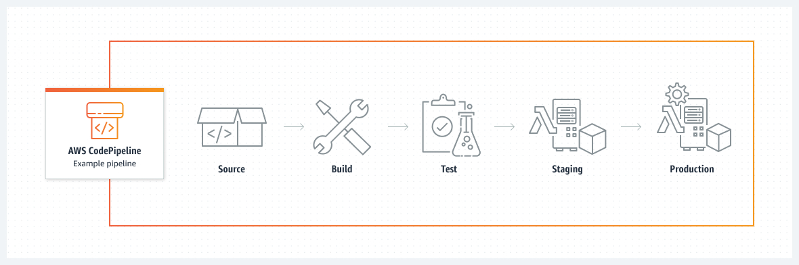

# Streamlining Deployment with AWS CodePipeline and Terraform: A Guide to Implementing CI/CD Pipelines



## Introduction

In the fast-paced world of software development, efficiency and reliability are key. Continuous Integration and Continuous Deployment (CI/CD) pipelines have become essential tools in achieving these objectives. This article delves into the implementation of CI/CD pipelines using AWS CodePipeline and Terraform to automate infrastructure changes and application updates.

## Understanding CI/CD Pipelines

CI/CD pipelines are automated processes that allow developers to frequently integrate code changes into a main branch and deploy these changes efficiently. The primary goals are to reduce manual errors, ensure code quality, and speed up release cycles.

## AWS CodePipeline: The Backbone of Automation
AWS CodePipeline is a fully managed continuous delivery service that helps automate release pipelines for fast and reliable updates. Key features include:

* Automated Workflows: Automate the build, test, and deploy phases of your release process.
* Integration with Other AWS Services: Seamlessly connect with AWS CodeBuild, AWS CodeDeploy, and more.
* Customization and Flexibility: Tailor your pipeline according to specific workflow needs.

## Terraform: Infrastructure as Code

Terraform by HashiCorp is an open-source tool that allows you to define and provision infrastructure using a high-level configuration language. With Terraform, you can manage cloud services and resources efficiently.

## Implementing CI/CD with AWS CodePipeline and Terraform

### Step 1: Setting Up AWS CodePipeline


```
resource "aws_codepipeline" "example" {
  name     = "terraform-codepipeline-demo"
  role_arn = aws_iam_role.example.arn

  artifact_store {
    location = aws_s3_bucket.example.bucket
    type     = "S3"
  }

  stage {
    name = "Source"
    action {
      name             = "Source"
      category         = "Source"
      owner            = "AWS"
      provider         = "S3"
      version          = "1"
      output_artifacts = ["source_output"]
      configuration    = {
        S3Bucket = aws_s3_bucket.example.bucket
        S3ObjectKey = "source.zip"
      }
    }
  }

  stage {
    name = "Build"
    action {
      name             = "Build"
      category         = "Build"
      owner            = "AWS"
      provider         = "CodeBuild"
      input_artifacts  = ["source_output"]
      output_artifacts = ["build_output"]
      configuration    = {
        ProjectName = "sample_project"
      }
    }
  }

}

```

This Terraform code snippet sets up an AWS CodePipeline with two stages: Source and Build. The Source stage pulls the source code from an S3 bucket, while the Build stage uses AWS CodeBuild to build the project.

### Step 2: Terraform Configuration for Infrastructure

```
resource "aws_instance" "example" {
  ami           = "ami-0c55b159cbfafe1f0"
  instance_type = "t2.micro"

  tags = {
    Name = "Terraform Example"
  }
}

```

This Terraform configuration creates a basic AWS EC2 instance. 

### Step 3: Automating Terraform with AWS CodeBuild

In your buildspec.yml for AWS CodeBuild, include the following commands to automate Terraform operations:

```
version: 0.2

phases:
  install:
    commands:
      - wget https://releases.hashicorp.com/terraform/0.12.29/terraform_0.12.29_linux_amd64.zip
      - unzip terraform_0.12.29_linux_amd64.zip
      - mv terraform $HOME/bin
  build:
    commands:
      - terraform init
      - terraform apply -auto-approve

```
This build specification installs Terraform and runs terraform init and terraform apply to provision the infrastructure defined in your Terraform configuration files.

## Best Practices for CI/CD Implementation
* **Version Control**: Keep Terraform configurations in a version control system.
* **Modular Terraform** Code: Write modular and reusable Terraform code.
* **Security Practices**: Implement strong security practices, including minimal privilege access.
* **Documentation**: Maintain comprehensive documentation for your CI/CD pipelines and infrastructure.

## Conclusion

Implementing CI/CD pipelines with AWS CodePipeline and Terraform is a robust approach to automating the deployment of infrastructure changes and application updates. This integration not only accelerates the deployment process but also enhances the reliability and stability of your applications.

## Further Reading

[AWS CodePipeline User Guide](https://docs.aws.amazon.com/codepipeline/latest/userguide/welcome.html)  
[Terraform Documentation](https://developer.hashicorp.com/terraform/docs) <br>
[CI/CD Best Practices](https://www.jetbrains.com/teamcity/ci-cd-guide/ci-cd-best-practices/)
