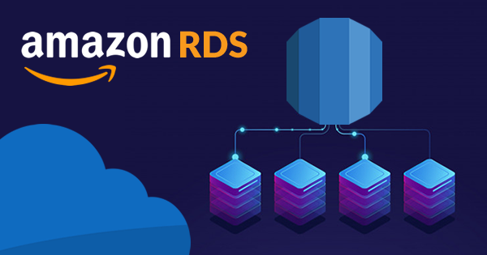

# Harnessing the Power of AWS: Integrating RDS, Aurora, and Elastic Cache for Enhanced Database Performance



Navigating the landscape of cloud database services can be challenging. Amazon Web Services (AWS) offers an array of solutions that address various aspects of database management. Among these, AWS Relational Database Service (RDS), Aurora, and Elastic Cache stand out as powerful solutions for diverse database needs. This article delves into the integration of these three services, exploring how they can be combined to enhance database performance.

## AWS RDS: A Robust Foundation

AWS RDS simplifies the setup, operation, and scaling of a relational database in the cloud. It provides cost-efficient and resizable capacity while automating time-consuming administration tasks such as hardware provisioning, database setup, patching, and backups.

RDS supports several database engines including MySQL, PostgreSQL, MariaDB, Oracle, and Microsoft SQL Server, making it a versatile choice for various applications.

### Key Benefits:

* **Automated Management:** Automates routine tasks such as patching, backups, and scaling.
* **Scalability:** Easily scales database resources to match demand.
* **Multi-Engine Support:** Compatible with various database engines, providing flexibility.

### Use Case Scenario:
Imagine an e-commerce platform experiencing variable traffic. With RDS, the database can scale automatically during peak shopping periods, ensuring consistent performance without manual intervention.

## Aurora: Next-Level Performance and Scalability

Aurora is a part of the RDS family but stands out for its enhanced performance and scalability. It's compatible with MySQL and PostgreSQL, offering up to five times the throughput of standard MySQL and three times that of standard PostgreSQL.

### Distinguishing Features:

* **High Throughput:** Offers up to five times the performance of standard MySQL databases.
* **Increased Availability:** Data is replicated across multiple Availability Zones for better durability.
* **Automatic Failover:** In case of a failure, Aurora automatically fails over to a standby instance.

### Practical Application:
For applications requiring high throughput and availability, like financial systems, Aurora ensures data integrity and consistent performance even under heavy loads.

## Elastic Cache: Turbocharging Database Performance

Elastic Cache is a web service that makes it easy to deploy, operate, and scale an in-memory cache in the cloud. It improves the performance of web applications by allowing you to retrieve information from fast, managed, in-memory caches, instead of relying solely on slower disk-based databases.

Elastic Cache supports two open-source in-memory caching engines:

**Redis:** Advanced data structures, pub/sub, and geospatial indexes.  
**Memcached:** Simple, pure caching with large nodes and horizontal scaling.

### Core Advantages

* **Speed**: Reduces data retrieval times by caching frequently accessed data.
* **Scalability**: Can scale horizontally to handle increased load.
* **Support for Redis and Memcached:** Offers flexibility in caching strategies.

**Scenario Example:**  
A social media app uses Elastic Cache to store user session data, significantly reducing login times and improving user experience.

## Integrating RDS, Aurora, and Elastic Cache

The integration of these services can be transformative. By using Elastic Cache in front of RDS or Aurora, you can cache query results or frequently accessed data, significantly reducing the load on the database and enhancing overall performance.

Extended Code Example:

Let’s consider a scenario where a web application uses AWS RDS (Aurora) for data storage and Elastic Cache (Redis) for caching. The application is a product catalog where users can view and search for products.

python
```
import redis
import pymysql
import json

# Establish a connection to Elastic Cache (Redis)
redis_client = redis.StrictRedis(host='your-elastic-cache-endpoint', port=6379, db=0)

# Establish a connection to Aurora
aurora_connection = pymysql.connect(host='your-aurora-endpoint',
                                    user='xxxx',
                                    password='xxxx',
                                    db='your-database',
                                    charset='utf8mb4',
                                    cursorclass=pymysql.cursors.DictCursor)

def query_database(query):
    # Attempt to retrieve data from Redis cache
    cached_data = redis_client.get(query)
    if cached_data:
        return json.loads(cached_data)
    
    # If not in cache, execute the query on Aurora
    with aurora_connection.cursor() as cursor:
        cursor.execute(query)
        result = cursor.fetchall()
        aurora_connection.commit()

        # Cache the result in Redis for future requests
        redis_client.setex(query, 3600, json.dumps(result))  # Cache for 1 hour
        return result

# Example usage: Fetch products in a specific category
products = query_database("SELECT * FROM products WHERE category = 'Electronics'")


```
## Conclusion

The combined use of AWS RDS (specifically Aurora) and Elastic Cache offers a robust, scalable, and efficient solution for managing and accessing database information. By offloading read operations and frequent queries to a caching layer, applications can achieve faster response times and reduced database load, leading to enhanced user experiences. Embracing these AWS services equips developers and organizations with the tools needed to build and maintain high-performing, resilient database systems.
